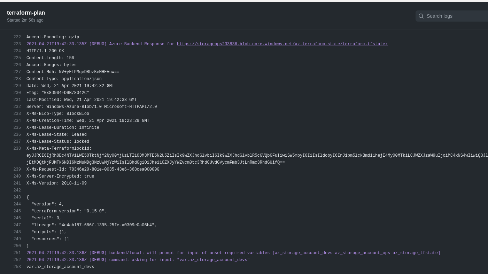

# Deployment steps

## Setup provisioning

```sh
bash 00.main.sh
```


# Issues

## terraform plan hangs in github actions



As we can here `command: asking for input: "var.az_storage_account_devs"` there are no variables, so we have to unignore `terraform.tfvars` file. LOL

## terraform plan is locked

When we try `terraform plan`


and in azure portal we see


or in az cli we can do

```sh
az storage blob show --name "terraform.tfstate" --container-name ${AZURE_STORAGE_TFSTATE} --account-name ${AZURE_STORAGE_ACCOUNT_OPS}  
```

to see 


Then we can break lease of blob in azure

```sh
az storage blob show --name "terraform.tfstate" --container-name ${AZURE_STORAGE_TFSTATE} --account-name ${AZURE_STORAGE_ACCOUNT_OPS}
```