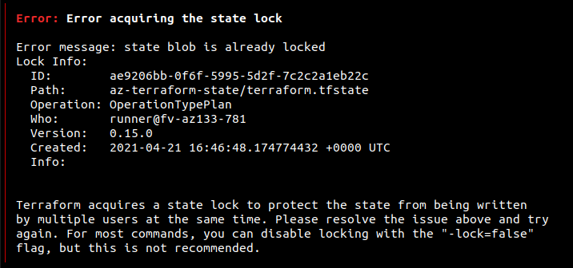
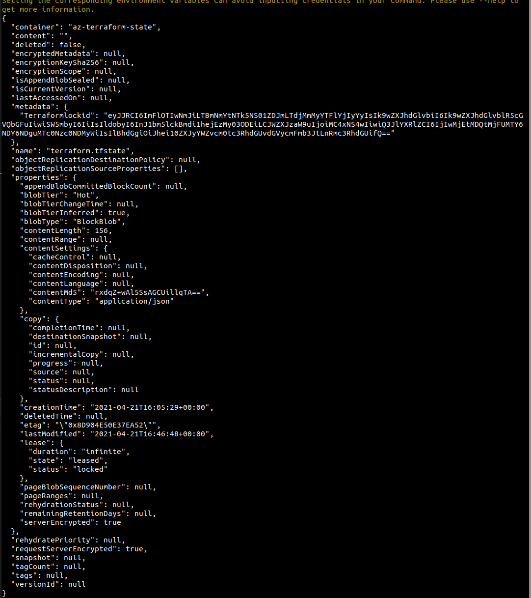

# Deployment steps

# Install terraform

```sh
bash 01.setup.terraform.sh
```

# Setup Azure RBAC

```sh
bash 01.setup.azure.rbac.sh
```

# Setup Azure for Terraform

```sh
bash 02.setup.azure.terraform.sh
```


# Issues

## terraform plan is locked

When we try `terraform plan`



and in azure portal we see


or in az cli we can do

```sh
az storage blob show --name "terraform.tfstate" --container-name ${AZURE_STORAGE_TFSTATE} --account-name ${AZU
RE_STORAGE_ACCOUNT_OPS}  
```

to see 



Then we can break lease of blob in azure

```sh
az storage blob show --name "terraform.tfstate" --container-name ${AZURE_STORAGE_TFSTATE} --account-name ${AZURE_STORAGE_ACCOUNT_OPS}
```